# ERD — 전체 컬럼

`gen_erd.py`가 DB 카탈로그(테이블·컬럼 COMMENT)에서 생성한다. 손으로 고치지 말 것.
이력(`vs_hist_h`)·첨부(`vs_file_b`)는 `tgt_tbl_nm + tgt_key`로 어느 테이블이든 가리키므로 관계선을 그리지 않았다.
이지웰 연동 지점까지 그린 그림: **[ERD 보기 (웹 페이지)](https://claude.ai/artifact/BG4DHMUaxjBHsM8iZXQxF6)** (공유받은 사람만 열림) · 파일로는 [erd.html](erd.html) · 설명은 README 4절.

```mermaid
erDiagram
    vs_co_b ||--o{ vs_join_b : "bizr_no"
    vs_co_b ||--o{ vs_mngr_b : "bizr_no"
    vs_biz_b ||--o{ vs_join_b : "biz_no"
    vs_join_b ||--o{ vs_join_b : "up_join_no 추가차수"
    vs_join_b ||--o{ vs_join_wrkr_b : "join_no"
    vs_co_b }o..o{ vs_ban_b : "bizr_no"
    vs_join_wrkr_b }o..o{ vs_ban_b : "person_key"
    vs_bbs_b ||--o{ vs_bbs_b : "up_bbs_no"
    vs_biz_b {
        character_varying biz_no PK "사업번호"
        character_varying biz_yr  "사업연도"
        numeric biz_ord  "사업차수"
        character_varying sprt_div_cd  "지원구분코드 (SPRT_DIV: GNRL 일반 / DVLP 발전 / PRTN 동반성장)"
        character_varying biz_nm  "사업명"
        character_varying biz_prgs_st_cd  "사업진행상태코드 (BIZ_PRGS_ST)"
        character_varying rcrt_strt_dtm  "모집시작일시"
        character_varying rcrt_end_dtm  "모집종료일시"
        character_varying jdg_strt_dt  "심사시작일자"
        character_varying jdg_end_dt  "심사종료일자"
        character_varying jdg_anc_dt  "심사발표일자"
        numeric rcrt_ppl_cnt  "모집정원수"
        numeric gov_shr_amt  "1인정부분담금액 (일반)"
        numeric comp_shr_amt  "1인기업분담금액 (일반)"
        numeric indv_shr_amt  "1인개인분담금액 (일반)"
        character_varying dvlp_obj_co_fg_list  "발전모델대상기업구분목록 (CO_FG 쉼표구분)"
        numeric dvlp_accum_yr_cnt  "발전모델대상누적참여년수"
        numeric dvlp_gov_shr_amt  "발전모델1인정부분담금액"
        numeric dvlp_comp_shr_amt  "발전모델1인기업분담금액"
        numeric dvlp_indv_shr_amt  "발전모델1인개인분담금액"
        jsonb add_rcpt_stup_json  "추가모집설정JSON [{co_fg_cd, open_yn, rcpt_strt_dtm, rcpt_end_dtm, dpst_strt_dtm, dpst_end_dtm}]"
        character_varying use_poss_strt_dt  "포인트사용가능시작일자 — 배정 API로 보내는 기본값. 배정 뒤 근로자별 기한은 이지웰 조회"
        character_varying use_poss_end_dt  "포인트사용가능종료일자 — 배정 API로 보내는 기본값. 근로자별 변경은 이지웰 API로 바로 보내고 vs_hist_h(MOD)에 남긴다"
        character_varying prtn_org_nm  "동반성장참여기관명 (PRTN)"
        character_varying prtn_org_bizr_no  "동반성장참여기관사업자번호 (PRTN)"
        character_varying prtn_mngr_nm  "동반성장기관담당자명 (PRTN)"
        character_varying prtn_mngr_eml_enc  "동반성장기관담당자이메일 (암호화)"
        character_varying prtn_mngr_telno_enc  "동반성장기관담당자전화번호 (암호화)"
        character_varying use_yn  "사용여부"
        numeric version  "버전 (동시 처리 잠금)"
        character_varying frst_reg_dtm  "최초등록일시"
        character_varying frst_reg_usr_id  "최초등록사용자ID"
        character_varying frst_reg_pgm_id  "최초등록프로그램ID"
        character_varying last_mod_dtm  "최종수정일시"
        character_varying last_mod_usr_id  "최종수정사용자ID"
        character_varying last_mod_pgm_id  "최종수정프로그램ID"
    }
    vs_co_b {
        character_varying bizr_no PK "사업자등록번호/고유번호"
        character_varying co_nm  "기업명"
        character_varying co_zip  "기업우편번호"
        character_varying co_addr  "기업주소"
        character_varying co_dtl_addr  "기업상세주소"
        character_varying rprs_nm  "대표자명 (공동대표 쉼표구분)"
        character_varying corp_yn  "법인여부"
        character_varying ind_div_cd  "업종구분코드 (KSIC 대분류)"
        character_varying rfnd_mthd_cd  "환불수단코드 (RFND_MTHD)"
        character_varying rfnd_bank_cd  "환불은행코드 (BANK)"
        character_varying rfnd_acnt_no_enc  "환불계좌번호 (암호화)"
        character_varying rfnd_dpstr_nm  "환불예금주명"
        character_varying rfnd_acnt_crtf_yn  "환불계좌인증여부"
        numeric version  "버전 (동시 처리 잠금)"
        character_varying frst_reg_dtm  "최초등록일시"
        character_varying frst_reg_usr_id  "최초등록사용자ID"
        character_varying frst_reg_pgm_id  "최초등록프로그램ID"
        character_varying last_mod_dtm  "최종수정일시"
        character_varying last_mod_usr_id  "최종수정사용자ID"
        character_varying last_mod_pgm_id  "최종수정프로그램ID"
    }
    vs_join_b {
        character_varying join_no PK "참여번호 (누리집 접수번호)"
        character_varying biz_no FK "사업번호"
        numeric join_add_rn  "신청차수 (0 최초, 1~ 추가인원)"
        character_varying up_join_no FK "상위참여번호 (추가차수 행 → 최초 행)"
        character_varying bizr_no FK "사업자등록번호 (vs_co_b)"
        character_varying co_fg_cd  "기업구분코드 (CO_FG, 그해 값)"
        character_varying exec_nm_list  "임원명목록"
        numeric ofc_wrkr_cnt  "상시근로자수"
        character_varying dsbl_hire_yn  "장애인근로자채용여부"
        numeric dsbl_hire_cnt  "장애인근로자채용수"
        character_varying join_chnl_cd  "참여경로코드 (JOIN_CHNL)"
        character_varying apl_mngr_nm  "신청담당자명"
        character_varying apl_mngr_eml_enc  "신청담당자이메일 (암호화)"
        character_varying apl_mngr_telno_enc  "신청담당자전화번호 (암호화)"
        character_varying apl_mngr_mbl_telno_enc  "신청담당자휴대전화번호 (암호화)"
        numeric apl_wrkr_cnt  "신청근로자수"
        numeric apl_dsbl_wrkr_cnt  "신청장애인근로자수"
        numeric fnl_wrkr_cnt  "최종참여근로자수 (입금액 산정 기준)"
        character_varying dvlp_mdl_yn  "발전모델적용여부"
        numeric gov_shr_amt  "1인정부분담금액 (신청시점 스냅숏) — 근로자 전원 동일하게 배정, 이지웰 3분할 기준"
        numeric comp_shr_amt  "1인기업분담금액 (신청시점 스냅숏) — 근로자 전원 동일하게 배정, 이지웰 3분할 기준"
        numeric indv_shr_amt  "1인개인분담금액 (신청시점 스냅숏) — 근로자 전원 동일하게 배정, 이지웰 3분할 기준"
        character_varying prtn_biz_no  "동반성장사업번호 (vs_biz_b PRTN 행)"
        character_varying join_st_cd  "참여상태코드 (JOIN_ST, AS-IS 27종)"
        character_varying join_st_chg_dtm  "참여상태변경일시"
        character_varying st_rsn_cntn  "최근상태사유내용 (보완·반려 사유, 누적은 vs_hist_h)"
        character_varying apl_dtm  "신청일시"
        character_varying fnl_sbmt_dtm  "최종제출일시 (70)"
        character_varying slct_dtm  "선정완료일시 (50)"
        character_varying reg_apv_dtm  "등록승인일시 (72)"
        character_varying reg_apv_usr_id  "등록승인사용자ID"
        character_varying pcpt_strt_dtm  "참여개시일시 (76)"
        character_varying cnfm_reg_dtm  "참여확인서등록일시"
        character_varying bulk_cncl_excp_yn  "일괄참여취소예외여부"
        character_varying prv_agr_yn  "개인정보수집이용동의여부"
        character_varying acnt_rsp_agr_yn  "기업계좌오기입책임동의여부"
        character_varying shop_rsp_agr_yn  "휴가샵미가입·적립금관리책임동의여부"
        character_varying agr_dtm  "약관동의일시"
        character_varying vacct_bank_cd  "가상계좌은행코드"
        character_varying vacct_no  "가상계좌번호"
        character_varying vacct_dpstr_nm  "가상계좌예금주명"
        character_varying vacct_iss_dtm  "가상계좌발급일시"
        numeric dpst_exp_amt  "입금예정금액"
        character_varying dpst_lmt_dt  "입금기한일자"
        numeric dpst_amt  "입금금액"
        character_varying dpst_cmpl_dtm  "입금완료일시"
        character_varying dpst_cnfm_usr_id  "입금확인사용자ID"
        character_varying ezwel_clnt_cd  "이지웰고객사코드"
        character_varying ezwel_br_cd  "이지웰소속1코드 = 사업연도 (ct_usr_b.cc_br_cd)"
        character_varying ezwel_dept_cd  "이지웰소속2코드 = 참여기업 (ct_usr_b.cc_dept_cd, 연도 내 0000~9999 → aaaa~)"
        character_varying br_lnk_st_cd  "이지웰 기업코드 생성 요청 상태 (LNK_ST) — 빈값: 아직 요청할 때 아님(최종승인 전) / W: 요청 대기(보낼 차례) / C: 완료(ezwel_dept_cd 받음) / F: 실패(재시도 대상, 오류는 vs_hist_h LNK)"
        character_varying br_lnk_dtm  "이지웰 기업코드 생성 요청을 마지막으로 보낸 일시 (성공·실패 모두)"
        numeric version  "버전 (동시 처리 잠금)"
        character_varying frst_reg_dtm  "최초등록일시"
        character_varying frst_reg_usr_id  "최초등록사용자ID"
        character_varying frst_reg_pgm_id  "최초등록프로그램ID"
        character_varying last_mod_dtm  "최종수정일시"
        character_varying last_mod_usr_id  "최종수정사용자ID"
        character_varying last_mod_pgm_id  "최종수정프로그램ID"
    }
    vs_join_wrkr_b {
        character_varying wrkr_no PK "근로자번호 — 이지웰 휴가샵 회원 테이블에 저장되는 우리 키(조회 조건). 이지웰 회원은 연도마다 새로 생기므로 회원 1명 = 이 행 1개"
        character_varying join_no FK "참여번호"
        character_varying wrkr_nm  "근로자명"
        character_varying brdt  "생년월일"
        character_varying person_key  "동일인키 (이름+생년월일 해시) — 우리 쪽 전용: 연도 내 중복신청·참여불가 매칭·재참여 통계. 이지웰에 보내지 않는다"
        character_varying mbl_telno_enc  "휴대전화번호 (암호화)"
        character_varying mbl_telno_hash  "휴대전화번호해시 (검색·중복확인)"
        character_varying eml_enc  "이메일 (암호화)"
        character_varying sclins_join_yn  "4대보험가입여부"
        character_varying prtn_pcpt_yn  "동반성장연계참가자여부"
        character_varying rmk  "비고"
        character_varying wrkr_jdg_st_cd  "근로자심사상태코드 (WRKR_JDG)"
        character_varying wrkr_jdg_rsn_cntn  "근로자심사사유내용"
        character_varying mbr_st_cd  "회원상태코드 (MBR_ST: L 미가입 ~ F 환불실패)"
        character_varying mbr_st_chg_dtm  "회원상태변경일시"
        character_varying shop_join_dtm  "휴가샵가입일시"
        character_varying use_stop_dtm  "이용정지일시"
        character_varying use_stop_rsn_cd  "이용정지사유코드 (USE_STOP_RSN)"
        character_varying use_stop_rsn_cntn  "이용정지사유내용 (기타)"
        character_varying use_stop_usr_id  "이용정지처리사용자ID"
        numeric rfnd_comp_amt  "환불기업금액"
        numeric rfnd_indv_amt  "환불개인금액"
        numeric rfnd_gov_rtrv_amt  "정부지원금회수금액"
        character_varying rfnd_stl_ym  "환불정산년월"
        character_varying rfnd_cmpl_dtm  "환불완료일시"
        character_varying rfnd_fail_rsn_cntn  "환불실패사유내용"
        character_varying mbr_lnk_st_cd  "이지웰 회원생성+포인트배정 API 처리 상태 (LNK_ST) — 빈값: 아직 보낼 때 아님(최종승인 전) / W: 보낼 차례(최종승인됨, 아직 성공 못함) / C: 완료(이지웰에 회원 생기고 포인트 들어감) / F: 실패(재시도 대상, 오류는 vs_hist_h LNK). 예) 최종승인→W→API 성공→C"
        character_varying mbr_lnk_dtm  "이지웰 회원생성+포인트배정 API를 마지막으로 호출한 일시 (성공·실패 모두)"
        numeric version  "버전 (동시 처리 잠금)"
        character_varying frst_reg_dtm  "최초등록일시"
        character_varying frst_reg_usr_id  "최초등록사용자ID"
        character_varying frst_reg_pgm_id  "최초등록프로그램ID"
        character_varying last_mod_dtm  "최종수정일시"
        character_varying last_mod_usr_id  "최종수정사용자ID"
        character_varying last_mod_pgm_id  "최종수정프로그램ID"
    }
    vs_mngr_b {
        character_varying mngr_id PK "계정ID (로그인 ID, 변경 불가)"
        character_varying mngr_div_cd  "계정구분코드 (MNGR_DIV: KTO 공사 / EZW 이지웰 / COMP 기업)"
        character_varying auth_cd  "역할코드 (AUTH, SB 역할) — KTO: AM 마스터·AL 총괄·AS 담당·AV 조회전용 / EZW: OM 마스터·OO 운영자 / COMP: CM 기업담당자"
        character_varying bizr_no FK "사업자등록번호 (기업담당자만)"
        character_varying biz_yr  "사업연도 (기업담당자만)"
        character_varying mngr_nm  "담당자명"
        character_varying brdt  "생년월일"
        character_varying mbl_telno_enc  "휴대전화번호 (암호화)"
        character_varying eml_enc  "이메일 (암호화)"
        character_varying dept_nm  "부서명"
        character_varying jbps_nm  "직책명"
        character_varying dup_crtf_key  "중복인증키 (복수 사업장 담당자)"
        character_varying pwd_hash  "비밀번호해시 (BCrypt)"
        character_varying prev_pwd_hash  "직전비밀번호해시 (재사용 금지 확인)"
        character_varying tmp_pwd_yn  "임시비밀번호여부"
        character_varying pwd_chg_dtm  "비밀번호변경일시"
        character_varying acnt_st_cd  "계정상태코드 (ACNT_ST)"
        numeric lgin_fail_cnt  "로그인실패수"
        character_varying last_lgin_dtm  "최종로그인일시"
        character_varying apv_st_cd  "계정승인상태코드 (ACNT_APV)"
        character_varying apv_usr_id  "승인사용자ID"
        character_varying apv_dtm  "승인일시"
        character_varying frst_reg_dtm  "최초등록일시"
        character_varying frst_reg_usr_id  "최초등록사용자ID"
        character_varying frst_reg_pgm_id  "최초등록프로그램ID"
        character_varying last_mod_dtm  "최종수정일시"
        character_varying last_mod_usr_id  "최종수정사용자ID"
        character_varying last_mod_pgm_id  "최종수정프로그램ID"
    }
    vs_hist_h {
        bigint hist_no PK "이력번호"
        character_varying hist_typ_cd  "이력유형코드 (HIST_TYP)"
        character_varying tgt_tbl_nm  "대상테이블명"
        character_varying tgt_key  "대상키"
        character_varying bef_val  "변경전값"
        character_varying aft_val  "변경후값"
        character_varying bulk_job_no  "일괄처리작업번호"
        character_varying rsn_cntn  "사유내용 (메모 본문·다운로드 사유 포함)"
        jsonb dtl_json  "상세JSON (유형별 상세)"
        character_varying ip_addr  "접속IP주소"
        character_varying reg_dtm  "등록일시"
        character_varying reg_usr_id  "등록사용자ID"
        character_varying reg_pgm_id  "등록프로그램ID"
    }
    vs_file_b {
        character_varying file_no PK "파일번호"
        character_varying tgt_tbl_nm  "대상테이블명"
        character_varying tgt_key  "대상키"
        character_varying file_div_cd  "파일구분코드 (FILE_DIV)"
        character_varying orgn_file_nm  "원본파일명"
        character_varying strg_path  "저장경로 (S3 키)"
        numeric file_size  "파일크기 (byte)"
        character_varying file_ext  "파일확장자"
        character_varying del_yn  "삭제여부"
        character_varying frst_reg_dtm  "최초등록일시"
        character_varying frst_reg_usr_id  "최초등록사용자ID"
        character_varying frst_reg_pgm_id  "최초등록프로그램ID"
        character_varying last_mod_dtm  "최종수정일시"
        character_varying last_mod_usr_id  "최종수정사용자ID"
        character_varying last_mod_pgm_id  "최종수정프로그램ID"
    }
    vs_bbs_b {
        character_varying bbs_no PK "게시물번호"
        character_varying bbs_div_cd  "게시물구분코드 (BBS_DIV)"
        character_varying up_bbs_no FK "상위게시물번호 (업무요청 2번째 사이클부터)"
        character_varying ctgr_cd  "분류코드 (구분별 분류·유형)"
        character_varying tgt_cd  "대상코드 (NOTI_TGT)"
        character_varying ttl  "제목"
        text cntn  "내용"
        character_varying wrtr_nm  "작성자명"
        character_varying wrtr_co_nm  "작성자기업명"
        character_varying wrtr_eml_enc  "작성자회신이메일 (암호화)"
        character_varying wrtr_mngr_id  "작성계정ID (업무요청)"
        character_varying prv_agr_yn  "개인정보수집동의여부"
        character_varying prcs_st_cd  "처리상태코드"
        text ans_cntn  "답변내용"
        character_varying ans_usr_id  "답변사용자ID"
        character_varying ans_dtm  "답변일시"
        character_varying disp_yn  "전시여부"
        character_varying disp_strt_dtm  "전시시작일시"
        character_varying disp_end_dtm  "전시종료일시"
        numeric sort_ordg  "정렬순서"
        numeric inq_cnt  "조회수"
        character_varying link_url  "링크URL"
        jsonb disp_opt_json  "전시옵션JSON (팝업 유형·크기, 버튼색 등)"
        character_varying frst_reg_dtm  "최초등록일시"
        character_varying frst_reg_usr_id  "최초등록사용자ID"
        character_varying frst_reg_pgm_id  "최초등록프로그램ID"
        character_varying last_mod_dtm  "최종수정일시"
        character_varying last_mod_usr_id  "최종수정사용자ID"
        character_varying last_mod_pgm_id  "최종수정프로그램ID"
    }
    vs_ban_b {
        character_varying ban_no PK "참여불가번호"
        character_varying ban_div_cd  "참여불가구분코드 (BAN_DIV: COMP 기업 / MBR 회원)"
        character_varying bizr_no  "사업자등록번호"
        character_varying co_nm  "기업명"
        character_varying co_fg_cd  "기업구분코드 (CO_FG)"
        character_varying ban_ctgr_cd  "참여불가분류코드"
        character_varying wrkr_nm  "근로자명 (MBR)"
        character_varying brdt  "생년월일 (MBR)"
        character_varying person_key  "동일인키 (MBR 매칭, 이름+생년월일 해시)"
        character_varying dtct_rout_cd  "적발경로코드 (DTCT_ROUT)"
        character_varying dtct_dt  "적발일자"
        character_varying aply_yn  "적용여부"
        character_varying ban_strt_dt  "참여불가시작일자"
        character_varying ban_end_dt  "참여불가종료일자 (빈 값 = 영구)"
        character_varying rmk  "비고"
        character_varying frst_reg_dtm  "최초등록일시"
        character_varying frst_reg_usr_id  "최초등록사용자ID"
        character_varying frst_reg_pgm_id  "최초등록프로그램ID"
        character_varying last_mod_dtm  "최종수정일시"
        character_varying last_mod_usr_id  "최종수정사용자ID"
        character_varying last_mod_pgm_id  "최종수정프로그램ID"
    }
    vs_cd_c {
        character_varying cd_grp PK "코드그룹"
        character_varying cd PK "코드"
        character_varying cd_nm  "코드명"
        numeric sort_ordg  "정렬순서"
        character_varying up_cd  "상위코드"
        character_varying cd_add_val1  "코드추가값1"
        character_varying cd_add_val2  "코드추가값2"
        character_varying use_yn  "사용여부"
        character_varying frst_reg_dtm  "최초등록일시"
        character_varying frst_reg_usr_id  "최초등록사용자ID"
        character_varying frst_reg_pgm_id  "최초등록프로그램ID"
        character_varying last_mod_dtm  "최종수정일시"
        character_varying last_mod_usr_id  "최종수정사용자ID"
        character_varying last_mod_pgm_id  "최종수정프로그램ID"
    }
```

