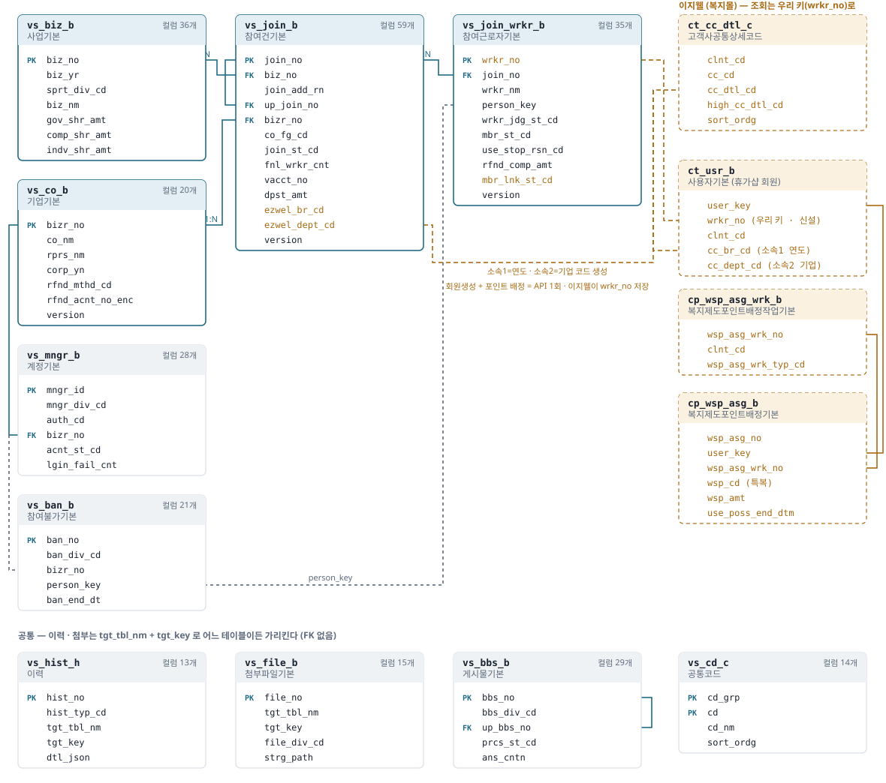
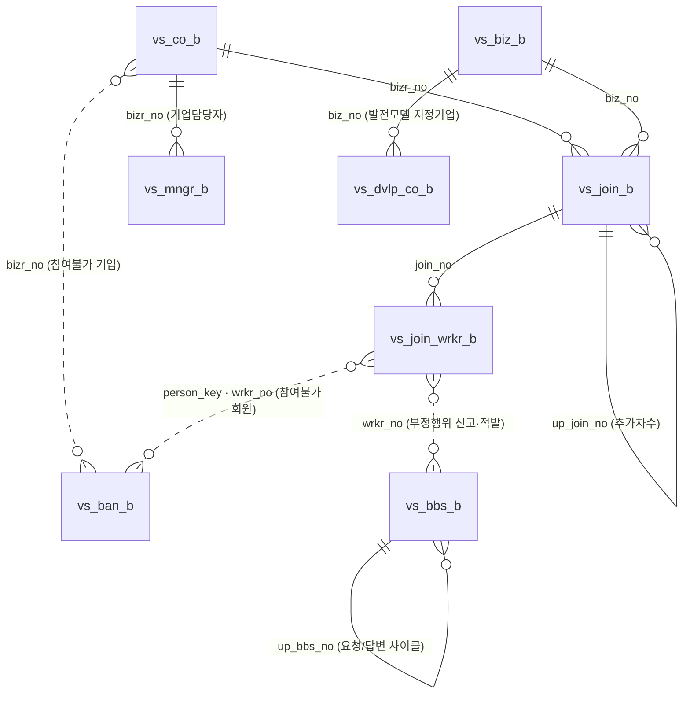

# 노동자 휴가지원사업 — 초기 DB 설계 (강병헌안)

기준일 2026-10-02 (v3) · PostgreSQL 16 · 대상: 누리집 FO · 기업 어드민 · 공사 어드민이 함께 쓰는 DB

**[ERD 보기 (웹 페이지)](https://claude.ai/artifact/BG4DHMUaxjBHsM8iZXQxF6)** — 이지웰 연동까지 그린 ERD와 검색 가능한 컬럼 명세. 비공개 페이지라 **공유받은 사람만** 열린다(접근 요청은 강병헌). 열리지 않으면 이 폴더의 [erd.html](erd.html)을 받아 브라우저로 연다.

[](erd.svg)

전체 컬럼과 설명은 [ERD.md](ERD.md)(GitHub에서 바로 보인다)에 있다.

| 파일 | 내용 |
|---|---|
| [01_ddl.sql](01_ddl.sql) | 테이블 11개 · 시퀀스 1개 · 이력 보호 트리거 |
| [04_comment.sql](04_comment.sql) | 테이블·컬럼 설명 COMMENT (DBeaver Comment 칸에 보인다) |
| [02_code_seed.sql](02_code_seed.sql) | 코드 21그룹 (AS-IS 실측값 + 이번에 새로 정한 값) |
| [03_check.sql](03_check.sql) | 빈 DB에 적용한 뒤 핵심 제약을 확인하는 스크립트 (`OK` 출력 시 통과) |
| [05_local_account_seed.sql](05_local_account_seed.sql) | **로컬 전용** 로그인 테스트 계정 12개 (계정구분 KTO·EZW·COMP × 역할, 잠금·휴면·중지·임시비번·미가입 상태별). 로그인 설계는 [docs/dev/login.md](../docs/dev/login.md) |
| [ERD.md](ERD.md) | 전체 컬럼 ERD (GitHub에서 Mermaid로 그려진다) |
| [erd.html](erd.html) | 이지웰 연동까지 그린 ERD + 검색 가능한 컬럼 명세 (브라우저로 연다) |
| [gen_erd.py](gen_erd.py) · catalog.json | DB 카탈로그 → ERD.md · erd.html 생성기. DDL·COMMENT를 바꾸면 카탈로그를 다시 떠서 돌린다 |

```bash
psql -v ON_ERROR_STOP=1 -d <빈DB> -f 01_ddl.sql -f 04_comment.sql -f 02_code_seed.sql -f 03_check.sql
```

근거 자료: 이 저장소 `admin/` 분석(특히 A6 데이터 맵 · 06 코드 · 07 업무 규칙 · A4 에스크로),
누리집 IA 시트(0928 업무프로세스 · 0929 회의 · 메모 탭), Tobe IA · Tobe 공사 어드민 기능정의 시트,
이지웰 테이블 샘플 4종(`ct_usr_b` · `ct_cc_dtl_c` · `cp_wsp_asg_b` · `cp_wsp_asg_wrk_b`),
류상오안 [db/류상오](https://github.com/hyundaiezwel/vacation-support-admin-asis/tree/main/db/류상오/README.md)(v2·v3에서 일부 반영 — 7절), SB 77화면 [`ez-sp-admin-sb`](https://github.com/hyundaiezwel/ez-sp-admin-sb)(v3에서 대조 — 3.6절).

---

## 1. 설계 원칙

| 항목 | 결정 |
|---|---|
| 테이블 분할 | **업무단위 와이드 테이블.** 하위 정보(담당자·가상계좌·입금·이용정지·환불)는 별도 테이블로 쪼개지 않고 컬럼으로 흡수 |
| 기업 | **기업기본 1테이블**(v2). 해마다 안 바뀌는 기업정보·환불계좌는 `vs_co_b`, 그해 값(기업구분·인원·신청 담당자)은 참여건 |
| 명명 · 타입 | **이지웰 표준.** 약어 snake_case, `_b` 기본 · `_c` 코드 · `_h` 이력. 일시 `varchar(14)` · 일자 `varchar(8)` · 감사컬럼 6종(`frst_reg_*` · `last_mod_*`) |
| 이지웰 회원·포인트 | **회원생성 + 포인트 배정은 API 1회**(v2). 이지웰이 우리 `wrkr_no`를 **회원 테이블**에 저장하고, 조회도 `wrkr_no`로 한다. 우리 쪽에는 `user_key`·배정번호·근로자별 사용기한을 두지 않는다. 우리가 남기는 건 성공/실패(`mbr_lnk_st_cd`)뿐 |
| 포인트 잔액·사용내역 | 저장하지 않음. 이지웰 API 조회 |
| 이력 | **공통 이력 1테이블** `vs_hist_h`. 트리거로 UPDATE/DELETE 차단 |
| 동시 처리 | 상태가 바뀌는 테이블에 `version`(v2). 갱신은 `where version = :읽은값`으로만 |
| 권한 | **계정구분(`mngr_div_cd`) + 역할(`auth_cd`) 고정**(v3). 계정별 권한 추가·회수 없음, 메뉴·권한 테이블 없음 — 메뉴 트리와 역할×동작 권한표는 코드(SB `roles.ts` 기준). 계정별 사업 범위도 두지 않는다 |
| 상태코드 | **AS-IS 코드값 유지** (`JOIN_ST` 27종 · `MBR_ST` 7종). 라벨은 정본으로 통일 |
| 과년도 데이터 | **이관하지 않음.** 2027 신규 데이터만 |
| 테이블 접두 | `vs_` (vacation support) |

## 2. 전체 구조



점선은 FK 없이 키로만 잇는 관계다. `vs_hist_h` · `vs_file_b`는 `tgt_tbl_nm + tgt_key`로 어느 테이블이든 가리킨다.

| # | 테이블 | 1행 = | 흡수한 것 (AS-IS 엔티티) |
|---|---|---|---|
| 1 | `vs_biz_b` 사업 | 연도 × 차수 × 지원구분 | E01 사업 · E02 발전모델(`sprt_div_cd='DVLP'` 행 1개 = 모델 1개) · E03 추가모집 창구(JSONB, `rcpt_ord`) · E14 사용기간 기본값 · 동반성장 협력사업(`sprt_div_cd='PRTN'` 행) |
| 1-1 | `vs_dvlp_co_b` 발전모델 지정기업 | 발전모델 × 사업자번호 | 적용 방식이 지정기업(`DSGN`)인 모델의 대상 기업 (v3) |
| 2 | `vs_co_b` 기업 | 사업자번호 | E04 기업 고정정보 · 환불계좌 |
| 3 | `vs_join_b` 참여건 | 기업 × 사업 × 신청차수 | E05 참여건 · E06 추가인원 신청(`join_add_rn>0` 행) · E11 가상계좌·입금 · 그해 기업구분·인원·신청 담당자 · 이지웰 소속1(연도)·소속2(기업) |
| 4 | `vs_join_wrkr_b` 참여근로자 | 참여건 × 근로자 | E09 근로자 · 근로자 심사 · E15 이용정지 · E16 환불 · 회원생성+배정 연동 결과 · 동일인 키 |
| 5 | `vs_mngr_b` 계정 | 로그인 ID | E07 기업담당자 · E08 공사 계정 · 이지웰 운영 계정 (역할은 SB 체계 AM·AL·AS·AV·OM·OO·CM) |
| 6 | `vs_hist_h` 이력 | 이벤트 1건 | 상태변경 · 메모 · 정보수정 · E24 알림발송 · 입금 · 이지웰 연동 · E25 다운로드 · 접속 · 개인정보 접근 · 일괄처리 묶음 |
| 7 | `vs_file_b` 첨부 | 파일 1개 | E10 제출서류 · 참여확인서 · 입금확인증 · 게시물 첨부 |
| 8 | `vs_bbs_b` 게시물 | 게시물 1건 (업무요청은 사이클 1회) | E22 신고 + E21 중고거래 모니터링 적발(`RPT` 하나, `ctgr_cd` WEB/MON) · E23 업무요청 · E26 공지·FAQ·자료실·팝업·배너 · 누리집 문의 · 매뉴얼 |
| 9 | `vs_ban_b` 참여불가 | 제재 1건 | E19 참여불가 기업 · E20 참여불가 회원 |
| 10 | `vs_cd_c` 코드 | 코드 1개 | 이지웰 `ct_cc_dtl_c` 모양 |

**만들지 않은 것:** E12 배정 · E13 사용 거래 · E17 청구서 · E18 잔여금 (이지웰 API 조회), E27 포인트·이용 통계 (이지웰 배치 — 0929 회의),
부적합 상품·키워드 (Tobe IA "스크래핑 필요 — 화면 UI만". 키워드·판정·조치는 외부(검색) 쪽이 저장하고 우리는 API만 부른다 — v3),
메뉴 · 메뉴권한 (권한은 계정구분 + 역할 고정 — v3).

## 3. 핵심 모델링

### 3.1 기업은 고정정보와 그해 값으로 나눈다

`vs_co_b`(사업자번호 1행)에 기업명 · 대표자 · 주소 · 법인여부 · 업종 · 환불계좌를 둔다. 재참여 기업은 이 행을 다시 쓴다.
해마다 바뀔 수 있는 기업구분 · 상시근로자수 · 장애인 채용 · 임원명 · 신청 담당자 연락처 · 분담금은 참여건(`vs_join_b`)에 그해 값으로 남긴다(심사 근거).
기업정보를 고치면 `vs_hist_h`(`MOD`)에 전후값이 남는다.

### 3.2 추가인원은 같은 테이블의 다음 행

```
join_no     join_add_rn  up_join_no  join_st_cd   fnl_wrkr_cnt  dpst_exp_amt
1000000002  0            (null)      76 참여개시   30            9,000,000
1000000003  1            1000000002  7610 입금중   5             1,500,000
```

AS-IS의 `70 → 72 → 74` 흐름을 추가인원 단위로 다시 도는 구조(`7600~7640`)와 맞는다. 추가차수 행도 자기 입금 · 자기 근로자를 갖는다.
추가 신청이 두 번 있어도 행이 둘이라 상태가 섞이지 않는다. `vs_join_b_ck1`이 "추가차수면 반드시 최초 행을 가리킨다"를 DB에서 보장한다.

### 3.3 근로자는 참여건마다 1행, 기업은 참여건으로 찾는다

근로자 행은 `join_no`만 갖는다. 기업 · 사업은 참여건을 거쳐 찾는다(v1의 `biz_no` · `bizr_no` 복사본은 v2에서 뺐다).
같은 사람은 `person_key`(이름+생년월일 해시)로 묶는다. 연도 내 중복 신청 강조 · 참여불가 회원 매칭 · 재참여율이 이 키를 쓴다.
이지웰 회원 키는 `person_key`가 아니라 `wrkr_no`다. 이지웰 회원은 연도마다 새로 생기므로(소속1 = 사업연도) 이지웰 회원 1명 = 참여근로자 1행이다. `person_key`는 동명이인 충돌 가능성이 있어 우리 쪽 통계·매칭에만 쓴다.

### 3.4 이력은 한 곳, 지울 수 없다

`hist_typ_cd`로 종류를 가르고, 종류별 상세는 `dtl_json`에 넣는다. 트리거가 UPDATE/DELETE를 거부한다(보안요구 SER-001 · 기능정의 "처리이력 수정·삭제 불가").
일괄 처리는 실행 1회에 `bulk_job_no` 하나를 매겨 건별 행을 쌓는다. "N건 중 M건 성공"이 아니라 어느 건이 실패했는지 조회된다.

### 3.5 동시 처리와 세션

- 두 관리자가 같은 신청을 동시에 심사하면 나중 저장이 실패한다: `update … set …, version = version + 1 where join_no = :id and version = :v` → 0건이면 충돌.
- 중복 로그인 차단 · 30분 무활동 로그아웃 · 2차 인증번호는 **DB가 아니라 Redis**(운영 AWS ElastiCache, 로컬 Redis 컨테이너)가 맡는다. 설계는 [docs/dev/login.md](../docs/dev/login.md).

### 3.6 SB 77화면 대조 (v3)

SB(`ez-sp-admin-sb`) 77화면을 화면마다 이 DDL에 맞대 보았다. 구현이 안 되는 화면은 없다. v3는 대조에서 나온 부족분을 채운 판이다.

| 판정 | 화면 수 | 예 |
|---|---|---|
| v2 그대로 가능 | 약 30 | 로그인 · 접속이력 · 공지 · FAQ · 배너 · 담당자 · 인원추가심사 · 통계 대부분 |
| 컬럼 추가로 가능 (v3 반영) | 약 30 | 사업상세 · 신청/기업/노동자 상세 · 참여증서 · 환불 · 팝업 · 문의 · 신고 |
| 이지웰 API 조회 | 약 15 | 포인트 · 청구 · 잔액 · 일매출 · 이용 통계 (조회 키 `wrkr_no` · 소속1·2 모두 있음) |

v3에서 바뀐 것:

- **발전모델** = `vs_biz_b` DVLP 행 1개 = 모델 1개. 모델 분담금은 그 행의 `gov/comp/indv_shr_amt`(v2의 `dvlp_*_shr_amt` 삭제). 지정 기업은 새 테이블 `vs_dvlp_co_b`. 참여건은 적용 모델을 `dvlp_biz_no`로 가리킨다.
- **누적 참여년수** `vs_co_b.accum_pcpt_yr_cnt` — 과년도를 이관하지 않으므로 AS-IS 값으로 1회 시드한다(발전모델 대상 판정).
- **환불**: 환불수단은 그해 값이라 `vs_co_b` → `vs_join_b.rfnd_mthd_cd`로 옮겼다. 개인분담금을 돌려줄 **개인 계좌**(`rfnd_bank_cd` · `rfnd_acnt_no_enc` · …)와 환불 차수 `rfnd_ord`를 근로자에 추가.
- **참여건**: 신청 계정 `apl_mngr_id`, 추가모집 창구 `add_rcpt_ord`, 참여증서 `cert_*`, 가상계좌 만료·상태, 미제출·예외 사유, 등록구분(누리집/일괄).
  기업 전체 최종인원 = 최초 행 + 추가완료(7640) 행의 `fnl_wrkr_cnt` 합. 최초 행 값을 덮어쓰지 않는다.
- **부정행위 신고·적발 한 게시판**: `vs_bbs_b` `RPT` + `ctgr_cd` WEB(누리집 신고) / MON(중고거래 적발). 처리상태는 `RPT_ST` 조치 4종 공통. 검색되는 값만 컬럼(`site_cd` · `pst_dtm` · `expl_st_cd` · `wrkr_no` · 연락처 · 이메일 해시), 나머지는 `disp_opt_json`.
- **참여불가**: 회원은 `wrkr_no`(그해 적발 행)와 `person_key`(다음 연도 매칭)를 함께, 근거 신고 `dtct_bbs_no`, 조치 여부·내용.
- **서류 심사**: `vs_file_b`에 파일 단위 심사 결과 · 보완 사유 · 제출 차수.
- **다운로드 사유 확인**: `vs_hist_h.chk_tgt_yn`(확인 대상)과 `CHK` 이력 행(원 이력을 `tgt_key`로 가리킴) — 이력은 여전히 INSERT 전용. `tgt_key`는 외부 키(청구번호·상품코드)를 위해 40자로 늘렸다.
- **게시물**: `del_yn`, 공지 상단고정, 팝업 노출 페이지, 업무요청 담당자(이관).
- **계정**: 기업 마스터 담당자 `mstr_yn`, 아이디 찾기용 휴대폰 해시, 잠금일시, 계정 신청 사유, 빠른메뉴.

## 4. 이지웰 연동

0928 회의 결론: **최종승인 시 ① 참여기업 코드 생성 ② 휴가샵 회원 생성 + 포인트 배정**. 주문 등 공통 테이블은 복지몰 것을 쓴다.

### 4.1 우리가 이지웰에 보내는 것

| 단계 | 우리 DB (보내는 값) | 이지웰 대상 | 우리가 남기는 것 |
|---|---|---|---|
| ① 참여기업 코드 | `vs_co_b.co_nm` · `bizr_no` · 사업연도 | `ct_cc_dtl_c` 2단: **소속1 = 사업연도**(연 1회), **소속2 = 참여기업**(`high_cc_dtl_cd`=소속1) | `ezwel_br_cd`(소속1) · `ezwel_dept_cd`(소속2) · `br_lnk_st_cd` |
| ② 회원생성 + 포인트 배정 (API 1회) | **`wrkr_no`** · `wrkr_nm` · `brdt` · 휴대폰 · 이메일 · 소속1·2 · 참여건의 1인 분담금(`gov/comp/indv_shr_amt`) · 사용기간(`vs_biz_b.use_poss_strt_dt`~`end_dt` 기본값) | 휴가샵 회원(`ct_usr_b` 계열, `cc_br_cd`=연도 · `cc_dept_cd`=기업) + 포인트 배정(`cp_wsp_asg_wrk_b`/`cp_wsp_asg_b`, `wsp_cd`=특복). **이지웰 회원 테이블에 `wrkr_no` 저장 컬럼 신설** (배정·사용내역은 이지웰이 자기 회원키로 잇는다) | `mbr_lnk_st_cd` · `mbr_lnk_dtm` |
| 3분할 기준 | `vs_join_b.gov_shr_amt` · `comp_shr_amt` · `indv_shr_amt` (같은 참여건 근로자는 전원 같은 금액) | 결제·취소 시 비율 연산 테이블 (이지웰 측, 0928) | — |
| 이용정지 | `wrkr_no` · `mbr_st_cd`='S' | 회원 이용 차단 API | — |
| 사용기간 변경 | `wrkr_no` · 관리자가 입력한 새 종료일 | 배정의 사용종료일시 (이지웰이 정본) | 저장 안 함. 누가·언제·전후값은 `vs_hist_h`(`MOD`) |

**연동 상태 컬럼 — 이지웰에 보낸 요청이 어떻게 됐는지 적는 칸이다.**

| 컬럼 | 무엇의 상태 |
|---|---|
| `vs_join_b.br_lnk_st_cd` | ① 기업 코드(소속2) 생성 요청 |
| `vs_join_wrkr_b.mbr_lnk_st_cd` | ② 회원생성 + 포인트 배정 API |

| 값 | 뜻 | 다음에 할 일 |
|---|---|---|
| (빈 값) | 아직 보낼 때가 아님 (최종승인 전) | — |
| `W` 요청 대기 | 최종승인돼 보낼 차례. 아직 성공하지 못함 | 배치·처리가 API를 호출한다 |
| `C` 완료 | 이지웰에 반영됨 (기업 코드 받음 / 회원 생기고 포인트 들어감) | 끝 |
| `F` 실패 | API가 오류를 돌려줌. 오류 내용은 `vs_hist_h`(`LNK`) | 재시도 → 성공하면 `C` |

예: 근로자 홍길동 최종승인 → `W` → 배치가 회원생성+배정 API 호출 → 이지웰 응답 오류 → `F` (+이력에 오류 원문) → 재시도 → `C`.
`*_lnk_dtm`은 마지막으로 호출한 일시(성공·실패 모두)다. 재시도 대상은 `mbr_lnk_st_cd in ('W','F')`로 찾는다(부분 인덱스).

소속1~4 = `ct_usr_b`의 `cc_br_cd` · `cc_dept_cd` · `cc_team_cd` · `cc_part_cd`. 소속3·4는 쓰지 않는다. 기업 코드는 연도 안에서 `0000`~`9999`, 다 쓰면 `aaaa`, `aaab`…(정렬은 `sort_ordg`).

### 4.2 이지웰에서 읽어 오는 것 (조회 API — 저장하지 않음)

포인트 잔액 · 지급/사용/취소 내역 · **근로자별 사용기한** · 이용내역 · 전자청구서 · 기업별 청구내역 · 가상계좌 잔액 · 환불내역 · 통계.
**조회 키는 우리 키다:** 근로자 `wrkr_no`, 기업 `ezwel_br_cd`+`ezwel_dept_cd`. 이지웰이 저장한 `wrkr_no`로 조건을 걸어 돌려준다.

### 4.3 에스크로

국민은행 DB를 직접 조회하는 방식(0929). 조회 결과를 `vs_join_b`의 `vacct_*` · `dpst_amt` · `dpst_cmpl_dtm`에 반영하고 원천 입금 건은 `vs_hist_h`(`DPST`)에 남긴다.

## 5. 보안 · 개인정보

- `_enc` 컬럼은 앱 계층 암호화(계좌번호 · 휴대폰 · 이메일). `_hash` · `person_key`는 검색·매칭용 단방향 해시.
- 이름 · 생년월일은 평문이다(목록 검색). 화면에서 마스킹한다.
- 비밀번호는 `pwd_hash`만 저장한다.
- 개인정보 보유기간은 동의서 기준 5년, 권한 이력은 3년 이상 보관해야 한다. 파기 배치는 정책이 정해지면 만든다.

## 6. 확인 필요

| # | 질문 | 영향 컬럼 | 누구 |
|---|---|---|---|
| 1 | ~~기업 코드 4자리 용량~~ → **결정(10-01): `0000`~`9999` 소진 뒤 `aaaa`, `aaab`…** 순번은 `sort_ordg` | `ezwel_dept_cd` | 확정 |
| 2 | ~~재참여 기업 코드~~ → **결정(10-01): 소속1 = 사업연도, 소속2 = 기업.** 4자리 한도도 연도마다 새로 시작 | `ezwel_br_cd` · `ezwel_dept_cd` | 확정 |
| 3 | ~~user_key 보관~~ → **결정(10-02): 보관 안 함.** 회원생성+배정 API 1회, 이지웰이 `wrkr_no`를 저장해 조회 키로 쓴다 | — | 확정 |
| 3-1 | ~~이지웰 저장 키~~ → **결정(10-02): `wrkr_no`.** 이지웰 휴가샵 회원은 연도마다 새로 생긴다(소속1 = 사업연도). 이지웰 회원 1명 = 우리 참여근로자 1행. `person_key`는 우리 쪽 재참여 통계·참여불가 매칭 전용이고 이지웰에 보내지 않는다 | `wrkr_no` · `person_key` | 확정 |
| 4 | "최종승인"이 어느 상태인지 — 회원생성+배정 시점이 `72 등록승인`인지 `74 입금완료`/`76 참여개시`인지 | `mbr_lnk_*` | 기획 · 공사 |
| 5 | 동반성장 협력사업을 사업(`vs_biz_b` PRTN 행)으로 둔 것이 맞는지. 참여기관↔지원기업 매핑을 누가 하는지 | `prtn_*` | 공사 |
| 6 | 근로자 단위 심사 상태(`WRKR_JDG`)가 TO-BE에 필요한지. 코드값은 이번에 새로 정했다 | `wrkr_jdg_st_cd` | 기획 |
| 7 | 이용정지 사유 · 사업 진행상태 · 계정상태 코드값(AS-IS에 코드가 없거나 신규) | `vs_cd_c` | 기획 |
| 8 | 기업담당자 계정이 연도별인지(AS-IS "매년 새로 가입") | `vs_mngr_b.biz_yr` | 기획 · 공사 |
| 9 | 반려 뒤 재신청 허용 여부 — 허용하지 않으면 `(biz_no, bizr_no, join_add_rn)` 유니크를 건다 | `vs_join_b` | 기획 |
| 10 | 동일인 키를 이름+생년월일로 충분한지(동명이인·동일 생일) — 휴대폰 해시를 더할지 | `person_key` | 기획 · 공사 |
| 11 | 이름 · 생년월일 암호화 여부 (ISMS) | `wrkr_nm` · `brdt` | 보안(최환호책임) |
| 12 | 성별 수집 여부 (0928 질문) — 수집하면 컬럼 추가 | `vs_join_wrkr_b` | 기획 |
| 13 | 업무요청 · 문의 유형과 처리상태 코드가 시트마다 다르다 — 정본 확정 후 시드 추가 | `ctgr_cd` · `prcs_st_cd` | 기획 |
| 14 | 사번 수집 여부 — SB 포인트 지급·청구내역·노동자 통계가 사번을 보이거나 검색한다. 수집하면 `emp_no` 추가, 아니면 화면에서 뺀다 | `vs_join_wrkr_b` | 기획 |
| 15 | 전자청구서 승인·반려(공사)를 이지웰이 정본으로 들고 필터를 지원하는지. 아니면 청구서 테이블이 필요하다 | (신규 테이블 후보) | 이지웰 |
| 16 | 분할입금 허용 여부 — 허용하면 가상계좌 목록의 "입금 차수" 필터 때문에 입금 테이블(`vs_dpst_h`)이 필요하다. 지금은 누적액 + 이력 | `dpst_amt` | 기획 · 공사 |
| 17 | 동반성장 참여기관 담당자가 어느 어드민을 쓰는지 — 계정이 필요하면 `MNGR_DIV`에 PRTN 추가 · `vs_mngr_b_ck1` 수정 | `vs_mngr_b` | 공사 |
| 18 | 신청 전 기업을 동반성장 지원기업으로 연계하는지(외부 상생 플랫폼 수신 포함) — 그렇다면 기관×기업×연도 매핑 테이블 | `vs_join_b.prtn_*` | 공사 |
| 19 | 거래사이트(`SITE`) · 다운로드 사유(`rsn_div_cd`) 코드값 | `vs_cd_c` | 기획 |
| 20 | 중고거래 적발(MON) 행을 누가 넣는지 — 수집 쪽이 우리 DB/API로 INSERT 하는 연동 방식 | `vs_bbs_b` | 솔루션 |
| 21 | 누적 참여년수 시드 출처 — AS-IS에서 기업별 값을 받을 수 있는지 | `accum_pcpt_yr_cnt` | 공사 |
| 22 | 신청 · 확정 · 이용정지 · 참여기업 · CS 통계는 원천이 우리 테이블이다 — "통계는 이지웰 배치"(0929)에서 이 부분은 우리 집계로 나눌지. 포인트 통계의 기업구분 축은 이지웰이 `co_fg`를 모른다 | 통계 | 기획 · 이지웰 |
| 23 | 성별 수집 여부(#12와 같음) — SB 이용내역 성별 필터가 있으나 우리·이지웰 어디에도 값이 없다 | `vs_join_wrkr_b` | 기획 |

## 7. 류상오안과 비교

> v3(10-02): 류상오안 v6.1([db/류상오](https://github.com/hyundaiezwel/vacation-support-admin-asis/tree/main/db/류상오/README.md), 26테이블)을 다시 대조했다. 26개 중 22개는 이 안의 테이블로 흡수되고,
> 나머지 4개 — `menu` · `menu_permission`(권한은 역할 고정으로 결정), `unfit_item`(외부 저장으로 결정), `fraud_report`의 모니터링 적발(`vs_bbs_b` RPT MON으로 흡수) — 도 결정으로 정리됐다.
> 류상오안에 남은 과년도 이관 컬럼(`data_source_cd` LEGACY · `legacy_*`)과 근로자별 포인트 기한(`point_expire_on`)은 이 안의 결정(이관 안 함 · 이지웰 조회)과 다르다.
> 아래 표는 v1(61테이블) 대조 기록이다.

근거가 다르다. 류상오안은 SB 명세(`ez-sp-admin-sb`, 77화면), 이 안은 AS-IS 분석 · 회의록 시트 · 이지웰 샘플이다.

| 항목 | 강병헌안 (v2) | 류상오안 | 정리 |
|---|---|---|---|
| 규모 | 테이블 10개 (와이드) | 61개 + 통계 마트 (정규화) | 원테이블 방향은 이 안 |
| 기업 | `vs_co_b` + 참여건에 그해 값 | `company` + `participation` | **v2에서 류상오안 방식 반영** |
| 추가인원 | 참여건의 다음 차수 행 | `additional_request`, 611~616 계산 | 류상오안이 지적한 "추가신청 2회 표현 불가"는 이 구조에는 없다(차수별 행) |
| 포인트 · 거래 · 청구서 | 저장 안 함 (API 조회, 우리 키로) | 복지몰 적재 테이블 5개, **재원별 3코드** 가정 | 류상오안 가정이 결정과 충돌: 9/11 메모 "특복만 사용 · 1코드", 0928 "비율 테이블은 이지웰", 10/02 "조회는 우리 키로" |
| 통계 | 이지웰 배치 | 우리 `stat_*` 마트 | 0929 "배치·통계는 복지몰 쪽"과 충돌 |
| 상태코드 | AS-IS 값 00~96 | SB 값 110~840 | SB `codes.ts`가 스스로 "미리보기용으로 지어낸 값"이라 밝힘. 라벨 27종은 같다 — 번호 체계만 합의하면 된다 |
| 명명 · 타입 | 이지웰 표준 (`frst_reg_dtm`, varchar(14)) | 영문 풀네임, `timestamptz`, `created_at` | 이지웰 담당자와 맞추려면 하나로 통일 필요 |
| 이지웰 매핑 | 소속1=연도 · 소속2=기업, `wrkr_no` 저장 | `mall_user_key`만 | 류상오안에는 소속 코드 연동이 없다 |
| 이력 | `vs_hist_h` 1개 | 도메인별 이력 · 알림 · 개인정보 · 감사 · 접속 테이블 | 원테이블 방향은 이 안 |
| 동시 처리 `version` | v2 반영 | 있음 | **반영** |
| 일괄 처리 건별 결과 | v2 반영 (`bulk_job_no`) | `bulk_job` · `bulk_job_item` | **반영** (테이블 대신 이력 컬럼) |
| 중복 로그인 세션 | Redis (ElastiCache) | `login_session` | 테이블 대신 Redis — [docs/dev/login.md](../docs/dev/login.md) |
| 동일인 키 | v2 반영 (`person_key`) | `person_key` | **반영** |
