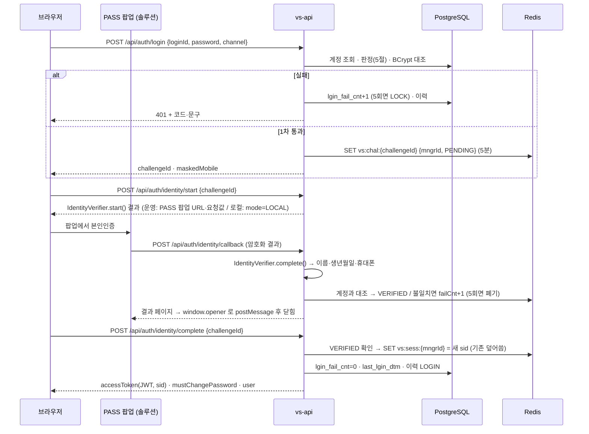

# 관리자 로그인 설계서 (1차 개발용)

기준일 2026-10-02 · 작성 강병헌 · 대상 화면 SP-CMN-010P 로그인 · 020P 로그아웃 · 030P 세션 만료 알림
1차 개발은 Cursor, 고도화는 Claude가 맡는다. **이 문서가 1차 개발의 기준이다.** Cursor 전달용 프롬프트는 [CURSOR_PROMPT.md](CURSOR_PROMPT.md).

근거: 이 저장소 SB 목업(`src/specs/SP-CMN-010P·020P·030P.json`, `src/pages/LoginPage.vue`, `src/app/SessionGuard.vue`, `src/app/session.ts`, `src/layouts/Shell.vue`, `docs/permissions.md`, `docs/ui-conventions.md`),
H-PMS 인증 구현(`HyundaiEzwel-AI-Dev-Lab/H-PMS` `docs/identity-auth-contract.md`, `backend/hpms-api/.../api/auth/*`), DB 설계 [`db/`](../../db/README.md),
업무구분 시트(`업무구분_바이브코딩_복지몰` A26·A28·B23), WBS(누리집BO 공통·시스템관리 10/13~10/16).

---

## 1. 범위와 담당

| 구분 | 이번에 우리가 만든다 | 틀만 만들고 상대가 붙인다 |
|---|---|---|
| 1차 인증 | ID·비밀번호 검증, 잠금·휴면·사용중지 판정, 실패 횟수 | — |
| 2차 인증 (**PASS 본인인증**) | 인증 요청 시작, 결과 수신, **이름·생년월일·휴대폰이 계정과 같은지 대조**, 5회 제한 | **PASS 연동**: `IdentityVerifier` 인터페이스. PASS 업체 모듈(요청 암호화 · 팝업 URL · 결과 복호화)은 본인인증 솔루션 담당(B23)이 구현체를 붙인다. 로컬은 이름·생년월일·휴대폰을 직접 입력하는 가짜 구현체 |
| 세션 | 세션 발급, 중복 로그인 차단, 30분 무활동 만료, 연장, 로그아웃 | **Redis**: 로컬은 컨테이너, 운영은 AWS ElastiCache(인프라팀) — 접속 정보만 env로 바꾼다 |
| 개인정보 암호화 | 휴대폰 복호화해서 대조 · 마스킹 표시 | **암호화**: `PiiCipher` 인터페이스. 복지몰 암호화 표준(A26)이 정해지면 구현체 교체. 로컬은 `{plain}` 통과 구현체 |
| 화면 | 로그인(ID·비밀번호 → PASS), 비밀번호 변경 모달, 세션 만료 모달, 셸·메인 연결 | — |
| 이력 | 로그인·로그아웃·실패를 `vs_hist_h`에 기록 | — |

**이번에 하지 않는 것:** 비밀번호 찾기(M2), 계정 관리 화면(SP-SYS-010L/D), 접속이력 화면(SP-SYS-020P), 역할별 메뉴·버튼 실제 제어, 기업 어드민 화면, 실제 PASS 연동, 실제 암호화. API·DB는 이 기능들이 그대로 얹히게 만든다.

## 2. 저장소 구성 · 기술 스택

이 저장소(`ez-sp-admin-sb`)에 **백엔드를 더하고, 지금 프론트를 실제 화면으로 키운다.** SB 목업(`#/sb`, `#/sp`)은 그대로 남긴다.

```
/                     지금 프론트 (Vite · Vue 3 · PrimeVue 4 · 디자인 시스템 src/ws) — 실제 화면도 여기
backend/              새로 — Spring Boot (H-PMS 구조)
db/                   DB 설계 원본 (01·02·03·04·05 sql, ERD)
deploy/local/         .env.secret.example (실제 .env.secret 은 커밋 금지)
scripts/              기존 검사 스크립트 + local-dev-up.sh · local-dev-api.sh
Makefile              새로
docs/dev/             이 설계서 · Cursor 프롬프트 · handoff
```

| 영역 | 내용 |
|---|---|
| 백엔드 | **H-PMS와 같게** — Spring Boot 3.5.x · Java 21 · Gradle 멀티모듈 `vs-api` / `vs-domain` / `vs-infra` · 패키지 `com.hyundaiezwel.vs` · MyBatis · Flyway · PostgreSQL 16 · Spring Data Redis(Lettuce) · JWT |
| 보안 | Spring Security STATELESS, CSRF·formLogin·httpBasic 끔. 공개 API는 `@PublicApi(reason=…)`, 현재 사용자는 `@LoginUser`. 비밀번호 BCrypt(api 모듈은 crypto 타입 import 금지 — ArchTest) |
| 응답 | `{ "success": true, "data": … }` / `{ "success": false, "error": { "code", "message", "fields" } }` · `ErrorCode` 한 곳에서 관리 |
| 프론트 | **이 저장소 그대로** — Vue 3.5 · Vite · vue-router 4(해시 라우팅) · **PrimeVue 4 + 디자인 시스템(`src/ws`, `docs/ui-conventions.md`)**. 추가: `pinia`, `axios` |
| DB | `db/01_ddl.sql` → Flyway `V1__init.sql`, `04_comment.sql` → `V2__comment.sql`, `02_code_seed.sql` → `V3__code_seed.sql`. 로컬 계정 시드 `05`는 Flyway 밖 `make dev-seed-accounts` |

### 2.1 목업과 실제 화면이 같이 사는 규칙

- **API 주소가 설정된 빌드에서만 실제 로그인을 쓴다.** `VITE_API_BASE`가 있으면 실제 API(`/api` 프록시), 없으면 지금 목업 로그인(아무 값이나 들어감) 그대로. GitHub Pages 빌드는 지금처럼 목업으로 남는다.
- `#/sb/**`(SB 목업 화면)·`#/sp/**`(미리보기)는 지우지 않는다. 실제 로그인 후에도 개발용으로 열린다.
- SB 가이드는 SB 화면 작성자에게 공통 파일(`src/app/*`, `src/ws/*`, `src/sb/*`, `src/router.ts`, `package.json`)을 고치지 말라고 한다. 이번 작업은 그 파일들을 고쳐야 하므로 **리포 주인(성찬민)과 PR로 맞춘다** — 고친 공통 파일은 handoff 문서에 목록으로 남긴다.
- `npm run build`(대비 검사 · 타입 검사)·`npm run check:sb`·`npm run check:responsive`가 계속 통과해야 한다.

## 3. 계정과 역할

| `mngr_div_cd` | 누구 | `auth_cd` (SB 역할, `docs/permissions.md`) | 들어올 수 있는 화면 |
|---|---|---|---|
| `KTO` | 한국관광공사 | `AM` 마스터 · `AL` 총괄 · `AS` 담당 · `AV` 조회전용 | 관리자 화면 |
| `EZW` | 현대이지웰(운영사) | `OM` 마스터 · `OO` 운영자 | 관리자 화면 |
| `COMP` | 참여기업 담당자 | `CM` | 기업 어드민 화면 (관리자 화면은 거부) |

로그인 API는 하나다. 요청에 `channel`(`ADMIN` | `COMP`)을 실어 보내고, 서버가 계정구분과 맞지 않으면 거부한다.

### 3.1 로컬 테스트 계정 — [`db/05_local_account_seed.sql`](../../db/05_local_account_seed.sql)

비밀번호는 시드 파일 머리 주석에 있다(로컬 전용). 운영·dev 서버에는 넣지 않는다. 이름·생년월일·휴대폰도 시드에 있다(로컬 PASS 가짜 인증에 그대로 입력).

| ID | 구분 · 역할 | 상태 | 확인할 것 |
|---|---|---|---|
| `kto.am` · `kto.al` · `kto.as` · `kto.av` | KTO · AM/AL/AS/AV | 사용 | 정상 로그인 |
| `ezw.om` · `ezw.oo` | EZW · OM/OO | 사용 | 정상 로그인 |
| `comp.cm` | COMP · CM | 사용 | 관리자 화면 거부, `channel=COMP`로는 통과 |
| `test.tmp` | KTO · AS | 사용 + 임시비밀번호 | 로그인 후 비밀번호 변경 모달 강제 |
| `test.lock` | KTO · AS | 잠금(실패 5회) | 잠금 문구 |
| `test.drmt` | KTO · AS | 휴면 | 휴면 문구 |
| `test.stop` | EZW · OO | 사용중지 | 사용중지 문구 |
| `comp.unrg` | COMP · CM | 미가입(비밀번호 없음) | 로그인 불가 |

## 4. 로그인 흐름



- **본인인증을 마치기 전에는 세션을 만들지 않는다**(SB 010P). 1차 통과는 Redis의 challenge 하나뿐이다.
- 로컬(`VS_IDENTITY_VERIFIER=local`)은 팝업 대신 로그인 화면에 이름·생년월일·휴대폰 입력란을 띄우고 `POST /api/auth/identity/local-verify`로 보낸다. 시드 값을 넣으면 통과, 다르게 넣으면 불일치를 시험할 수 있다. 이 API는 `local` 프로필에서만 열린다.

## 5. 1차 인증 판정 순서와 문구

위에서부터 처음 걸리는 것으로 끝낸다. 문구는 SB 010P 기준.

| 순서 | 조건 | 결과 코드 (`error.code`) | 화면 문구 | 실패 횟수 |
|---|---|---|---|---|
| 1 | ID 없음 | `AUTH_INVALID_CREDENTIALS` | 아이디 또는 비밀번호가 일치하지 않습니다. | 올리지 않음 |
| 2 | `acnt_st_cd=LOCK` | `AUTH_LOCKED` | 계정이 잠겼습니다. 마스터 관리자에게 잠금 해제를 요청하세요. | — |
| 3 | 비밀번호 불일치 (비밀번호 없는 계정 포함) | `AUTH_INVALID_CREDENTIALS` | 1과 같은 문구 | +1, 5회째에 `acnt_st_cd=LOCK` (5회째 응답부터 `AUTH_LOCKED`) |
| 4 | `acnt_st_cd=STOP` | `AUTH_STOPPED` | 사용이 중지된 계정입니다. | — |
| 5 | `acnt_st_cd=DRMT`, 또는 `last_lgin_dtm`이 6개월 넘음 | `AUTH_DORMANT` | 6개월 이상 접속하지 않아 휴면 처리된 계정입니다. 마스터 관리자에게 해제를 요청하세요. | — (6개월 초과면 이때 `DRMT`로 바꾼다) |
| 6 | `acnt_st_cd=UNRG` | `AUTH_NOT_REGISTERED` | 가입이 완료되지 않은 계정입니다. | — |
| 7 | 채널 불일치 (`ADMIN`에 COMP, `COMP`에 KTO·EZW) | `AUTH_CHANNEL_DENIED` | 기업 담당자는 기업 관리자 화면에서 로그인하세요. (`data.redirectUrl`) | — |
| 8 | 휴대폰 미등록 (`mbl_telno_enc` 없음) | `AUTH_IDENTITY_UNAVAILABLE` | 본인인증에 필요한 휴대폰 번호가 등록되지 않았습니다. 마스터 관리자에게 문의하세요. | — |
| 9 | 통과 | — | 본인인증으로 | — |

- 잠금 계정은 비밀번호를 대조하지 않고 막는다. 사용중지·휴면·미가입·채널·휴대폰 미등록은 **비밀번호가 맞은 뒤에만** 알려 준다 — 비밀번호를 모르는 사람에게 계정 상태를 흘리지 않기 위해서다.
- 없는 계정에도 더미 해시를 대조해 응답 시간을 맞춘다(H-PMS와 동일).
- 휴면 기준 6개월은 env `VS_AUTH_DORMANT_AFTER=P6M`. AS-IS는 90일 — 확인 필요(14절).

## 6. 세션 · 중복 로그인 (Redis)

### 6.1 키

| 키 | 값 | TTL | 쓰임 |
|---|---|---|---|
| `vs:sess:{mngrId}` | hash `{sid, chnl, issuedAt, absExpAt, ip, ua}` | **30분 sliding** | 계정당 세션 1개. 새 로그인이 덮어쓴다 |
| `vs:kick:{sid}` | 끊긴 사유 `DUPLICATE` | 12시간 | 끊긴 쪽에 "다른 곳에서 로그인" 문구를 주려고 남긴다 |
| `vs:chal:{challengeId}` | hash `{mngrId, chnl, state: PENDING·VERIFIED, failCnt, txId}` | 5분 | 1차 통과 ~ 본인인증 완료 사이. `txId`는 PASS 거래 식별값(콜백과 짝 맞춤) |

키 접두는 env `VS_REDIS_KEY_PREFIX`(기본 `vs:`).

### 6.2 규칙

- **JWT claim**: `sub=mngrId`, `div`, `auth`, `chnl`, `sid`, `exp=absExpAt`(로그인 후 **12시간** 절대 상한, `VS_AUTH_ABSOLUTE_TIMEOUT=PT12H`). refresh token은 두지 않는다 — 세션 유효성은 매 요청 Redis로 판정한다.
- **매 인증 요청**: JWT 서명·만료 확인 → `vs:sess:{sub}` 조회 → `sid`가 같으면 통과하고 TTL을 30분으로 되돌린다.
  - 키가 없으면 `AUTH_SESSION_EXPIRED`(무활동 30분 또는 로그아웃).
  - `sid`가 다르면 `AUTH_SESSION_REPLACED` — "다른 곳에서 로그인되어 종료되었습니다."
- **유휴 만료** `VS_AUTH_IDLE_TIMEOUT=PT30M`. 화면은 만료 5분 전(`VS_AUTH_WARN_BEFORE=PT5M`)에 알림(SB 030P). 서버 판정에는 쓰지 않는다.
- **화면 표시용 조회**(`GET /session`)는 TTL을 되돌리지 않는다 — 타이머가 스스로 세션을 늘리면 무활동 만료가 영영 안 온다.
- **연장** `POST /session/extend` — TTL을 되돌린다. 계정이 사용 상태가 아니면 연장하지 않고 끊는다(SB 030P).
- **로그아웃**: `vs:sess:{mngrId}`를 지우고 이력에 사유(`MANUAL` · `IDLE` · `DUPLICATE` · `STOPPED`).
- **Redis 장애**: 로그인·인증 요청 모두 503 `AUTH_SESSION_STORE_UNAVAILABLE`. 통과시키지 않는다(fail-closed).

### 6.3 로컬 / 운영 차이 — env만 다르다

| 항목 | 로컬 | 운영 (AWS ElastiCache for Redis) |
|---|---|---|
| Redis 주소 | `VS_REDIS_HOST=localhost` · `VS_REDIS_PORT=6389` | 인프라팀이 주는 엔드포인트 |
| TLS · 인증 | 없음 | `VS_REDIS_SSL=true` · `VS_REDIS_PASSWORD`(AUTH 토큰, 시크릿) |
| 정책 | — | 클러스터 모드 끔, `maxmemory-policy=noeviction` 요청 |
| 본인인증 | `VS_IDENTITY_VERIFIER=local` — 입력값 대조 | `pass` — PASS 솔루션 구현체 |
| 개인정보 복호화 | `VS_PII_CIPHER=plain` — `{plain}` 접두 값 그대로 | `standard` — 복지몰 암호화 표준 구현체 |

로컬 구현체(`LocalIdentityVerifier`, `PlainPiiCipher`)와 `/identity/local-verify` API는 **`local` 프로필에서만** 등록한다. 다른 프로필에서 잡히면 기동을 실패시킨다.

## 7. 본인인증 (PASS)

- **대조 기준: 이름 + 생년월일 + 휴대폰 세 가지가 모두 같아야 통과.** CI는 쓰지 않는다(FO에서 받는 정보가 이 세 가지라 계정에 CI를 미리 둘 수 없다).
  - 이름: 앞뒤 공백 제거 후 정확히 일치
  - 생년월일: `yyyymmdd` 일치 (`vs_mngr_b.brdt`)
  - 휴대폰: 숫자만 남겨 일치 (`PiiCipher.decrypt(mbl_telno_enc)`)
- 불일치면 `failCnt+1`, 5회면 challenge 폐기 → 1차부터 다시. 불일치 응답에는 **어느 항목이 틀렸는지 알려 주지 않는다**.
- 휴대폰을 바꾼 사람은 본인인증이 안 된다 → 마스터 관리자가 계정 정보의 휴대폰을 고친 뒤 인증(안내 문구로 처리).
- 콜백의 `txId`가 challenge의 `txId`와 다르면 거부(다른 사람 인증 결과 끼워 넣기 방지).
- PASS 결과(이름·생년월일·휴대폰·CI)는 **저장하지 않는다.** 이력에는 성공/실패와 거래 식별값만.

```java
// vs-domain — 본인인증 솔루션(B23)이 구현체를 붙이는 틀. 구현체는 vs-infra 에 둔다
public interface IdentityVerifier {
    /** 인증 시작 — 팝업 URL · 요청값(암호화) · 거래 식별값을 돌려준다. 로컬은 mode=LOCAL 만 */
    IdentityStart start(String challengeId, String returnUrl);
    /** 콜백 결과 복호화 — 이름 · 생년월일(yyyymmdd) · 휴대폰(숫자) · 거래 식별값 */
    IdentityResult complete(Map<String, String> callbackParams);
}
public interface PiiCipher {                    // 복지몰 암호화 표준(A26)
    String encrypt(String plain);
    String decrypt(String cipher);
}
```

## 8. 비밀번호

- 규칙(SB · 보안요구 SER-001): 영대·영소·숫자·특수 중 **2종 10자 이상** 또는 **3종 8자 이상**. 아이디와 같으면 안 된다.
- 현재·직전 비밀번호 재사용 금지: `pwd_hash`, `prev_pwd_hash`와 BCrypt 대조.
- 변경하면 `prev_pwd_hash ← pwd_hash`, `pwd_hash ← 새 해시`, `tmp_pwd_yn='N'`, `pwd_chg_dtm`, `vs_hist_h`(`MOD`)에 기록(값은 남기지 않는다).
- **임시비밀번호**(`tmp_pwd_yn='Y'`): 로그인은 되지만 응답에 `mustChangePassword=true`. 서버는 비밀번호 변경·로그아웃·내 정보·세션 외 API를 403 `AUTH_PASSWORD_CHANGE_REQUIRED`로 막는다(H-PMS `PasswordChangeRequiredInterceptor` 방식). 화면은 닫을 수 없는 변경 모달.

## 9. API

모두 `/api/auth`. 로그인 전 API(`/login`, `/identity/*`)는 `@PublicApi`.

| 메서드 · 경로 | 요청 | 성공 응답 `data` | 주요 실패 코드 |
|---|---|---|---|
| `POST /login` | `{loginId, password, channel}` | `{challengeId, maskedMobile:'010-****-0001', expiresAt}` | `AUTH_INVALID_CREDENTIALS` `AUTH_LOCKED` `AUTH_STOPPED` `AUTH_DORMANT` `AUTH_NOT_REGISTERED` `AUTH_CHANNEL_DENIED` `AUTH_IDENTITY_UNAVAILABLE` |
| `POST /identity/start` | `{challengeId}` | `{mode:'PASS'|'LOCAL', popupUrl?, form?: {…}}` | `AUTH_CHALLENGE_EXPIRED` `AUTH_IDENTITY_PROVIDER_ERROR` |
| `POST /identity/callback` | PASS가 보내는 값 | 결과 HTML(부모 창에 `postMessage({type:'vs-identity', challengeId, ok})` 후 닫힘) | — |
| `POST /identity/local-verify` *(local만)* | `{challengeId, name, birth, mobile}` | `{verified:true}` | `AUTH_IDENTITY_MISMATCH`(`fields.remaining`) `AUTH_IDENTITY_TOO_MANY_ATTEMPTS` |
| `POST /identity/complete` | `{challengeId}` | `{accessToken, expiresAt, absoluteExpiresAt, mustChangePassword, user:{mngrId, name, div, auth}}` | `AUTH_IDENTITY_NOT_VERIFIED` `AUTH_IDENTITY_MISMATCH` `AUTH_IDENTITY_TOO_MANY_ATTEMPTS` `AUTH_CHALLENGE_EXPIRED` |
| `POST /logout` | `{reason?}` | `{}` | — |
| `GET /me` | — | `{mngrId, name, div, auth, deptNm, jbpsNm, lastLoginAt, mustChangePassword}` | `AUTH_SESSION_EXPIRED` `AUTH_SESSION_REPLACED` |
| `GET /session` | — | `{expiresAt, absoluteExpiresAt, warnBeforeSec}` | 같음 |
| `POST /session/extend` | — | `{expiresAt}` | 같음 + `AUTH_STOPPED` |
| `PUT /password` | `{currentPassword, newPassword}` | `{}` | `AUTH_PASSWORD_POLICY` `AUTH_PASSWORD_REUSED` `AUTH_INVALID_CREDENTIALS` |

HTTP 상태: 인증 실패 401, 권한·비번변경 강제 403, 입력 오류 400, 세션 저장소·본인인증 업체 장애 503.

## 10. 이력 — `vs_hist_h`

| 사건 | `hist_typ_cd` | `tgt_tbl_nm`·`tgt_key` | `aft_val` | `dtl_json` |
|---|---|---|---|---|
| 1차 실패 | `LGIN` | `vs_mngr_b` · 입력한 ID | 결과 코드 | `{chnl, ip, ua, failCnt}` |
| 본인인증 실패 · 폐기 | `LGIN` | 〃 | `AUTH_IDENTITY_MISMATCH` · `AUTH_IDENTITY_TOO_MANY_ATTEMPTS` | `{chnl, txId, ip}` |
| 로그인 성공 | `LGIN` | 〃 | `LOGIN` | `{chnl, txId, sid, ip, ua}` |
| 로그아웃 · 끊김 | `LGIN` | 〃 | `LOGOUT` | `{reason, sid}` |
| 잠금 · 휴면 전환 | `ST` | 〃 | `LOCK` · `DRMT` (`bef_val`=이전 상태) | `{reason}` |
| 비밀번호 변경 | `MOD` | 〃 | `PASSWORD` | `{byTmp}` |

`reg_usr_id`는 로그인한 계정 ID, 로그인 전 실패는 `ANONYMOUS`. 이 이력이 접속이력 화면(SP-SYS-020P)의 원천이다. PASS 결과 개인정보는 넣지 않는다.

## 11. 프론트 (이 저장소)

| 위치 | 내용 |
|---|---|
| `src/pages/LoginPage.vue` | 지금 목업을 실제로 바꾼다. 1단계 ID·비밀번호(보기 토글, ID 저장) → 2단계 본인인증(PASS 팝업 열기 버튼 · 진행 상태 / 로컬 모드면 이름·생년월일·휴대폰 입력). `VITE_API_BASE`가 없으면 지금 목업 동작 유지. 화면에 "관리자/Admin" 단어를 쓰지 않는다(RFP MPR-008) |
| `src/app/session.ts` · `src/app/SessionGuard.vue` | 목업의 30분·연장 로직을 **서버 `expiresAt` 기준**으로 바꾼다. 예고는 5분 전(SB 030P spec — 지금 목업은 2분). 연장은 `POST /session/extend`. 탭 동기화 `BroadcastChannel('vs-auth')` |
| `src/auth/` (새로) | `api.ts`(axios 인스턴스 · Bearer 주입 · 오류 코드별 처리), `tokenStore.ts`(메모리 + sessionStorage `vs.accessToken`, 저장 ID는 localStorage `vs.savedLoginId`), `store.ts`(Pinia: login · startIdentity · completeIdentity · logout · restore · extend), `PasswordChangeModal.vue` |
| `src/router.ts` | `/login` 외 전부 인증 필요(실제 모드일 때). `AUTH_SESSION_EXPIRED`·`AUTH_SESSION_REPLACED`면 사유 문구와 함께 `/login` |
| `src/layouts/Shell.vue` · `src/app/TopBar.vue` | 상단바 사용자 영역에 로그인한 사람 이름·역할, 로그아웃 |
| 메인 | 로그인 후 첫 화면은 `#/sb/s/SP-CMN-050P`(메인 목업) |

UI는 이 저장소의 디자인 시스템(`src/ws`)과 [UI 규약](../ui-conventions.md)을 따른다. 모달 코드는 `SP-CMN-010P-M1`(비밀번호 변경), `SP-CMN-030P-M1`·`M2`(세션 예고·만료).

## 12. 로컬 개발 환경

H-PMS와 같은 `docker run` + Makefile 방식. 포트는 H-PMS와 겹치지 않게 잡는다.

| 무엇 | 컨테이너 / 프로세스 | 포트 |
|---|---|---|
| PostgreSQL 16 | `vs-local-dev-postgres` (DB·계정 `vs`) | 5442 |
| Redis 7 | `vs-local-dev-redis` | 6389 |
| API | `make dev-api` | 8090 |
| 프론트 | `npm run dev` (지금 포트 5320 그대로, `/api` → `http://localhost:8090` 프록시) | 5320 |

| Makefile 타깃 | 하는 일 |
|---|---|
| `dev-up` | postgres·redis 컨테이너 기동(네트워크 `vs-local-dev-net`) |
| `dev-down` · `dev-reset` | 중지 · 볼륨까지 초기화 |
| `dev-api` | env 파일을 읽어 API 기동(Flyway 자동) |
| `dev-seed-accounts` | `db/05_local_account_seed.sql` 적용 |
| `test` | 백엔드 `gradlew test` + 프론트 `npm run build` · `npm run check:sb` |

env 파일 `deploy/local/.env.secret`(커밋 금지, `.env.secret.example`만 커밋): `VS_DB_URL` `VS_DB_USER` `VS_DB_PASSWORD` `VS_JWT_SIGNING_KEY` `VS_REDIS_HOST` `VS_REDIS_PORT` `VS_REDIS_SSL` `VS_REDIS_PASSWORD` `VS_REDIS_KEY_PREFIX` `VS_AUTH_IDLE_TIMEOUT` `VS_AUTH_ABSOLUTE_TIMEOUT` `VS_AUTH_WARN_BEFORE` `VS_AUTH_DORMANT_AFTER` `VS_IDENTITY_VERIFIER` `VS_PII_CIPHER` `VS_ADMIN_URL` `VS_COMP_URL`. 프론트는 `.env.local`에 `VITE_API_BASE=/api`.

## 13. 완료 기준

로컬에서 `make dev-up → make dev-api → make dev-seed-accounts → npm run dev`(`VITE_API_BASE` 설정) 후 확인한다.

1. `kto.am` 로그인 → 로컬 본인인증에 시드의 이름·생년월일·휴대폰 입력 → `#/sb/s/SP-CMN-050P` 메인, 상단바에 이름·역할
2. `ezw.om`도 같은 흐름으로 들어간다
3. `comp.cm`은 관리자 화면에서 `AUTH_CHANNEL_DENIED` 문구, API에 `channel=COMP`로는 본인인증까지 간다
4. 없는 ID와 틀린 비밀번호의 문구가 같다
5. 비밀번호 5회 틀리면 5회째부터 잠금 문구, DB `acnt_st_cd=LOCK`, 이력 `ST` 1건
6. `test.lock` · `test.drmt` · `test.stop` · `comp.unrg`가 5절 결과대로 막힌다
7. `test.tmp`는 로그인 후 닫을 수 없는 변경 모달, 변경 전에는 다른 API가 403, 변경 후 정상. 직전 비밀번호로는 변경 불가
8. 본인인증에 다른 이름(또는 생년월일·휴대폰)을 넣으면 불일치(어느 항목인지는 안 알려 줌), 5회면 처음부터, 5분 지나면 만료
9. 본인인증 완료 전에는 `/identity/complete`가 `AUTH_IDENTITY_NOT_VERIFIED`, 다른 challenge로는 완료 불가
10. 브라우저 A 로그인 후 B로 같은 계정 로그인 → A의 다음 요청에서 "다른 곳에서 로그인되어 종료되었습니다"
11. 30분 무활동 → 25분에 예고 모달, 연장하면 다시 30분, 두면 만료 모달 → 로그인 (테스트는 env로 시간 단축). 한 탭에서 연장하면 다른 탭 모달도 닫힌다
12. Redis 컨테이너를 멈추면 로그인·API가 503
13. 모든 시도가 `vs_hist_h`(`LGIN`)에 남고, PASS 결과 개인정보는 어디에도 저장되지 않는다
14. `VITE_API_BASE` 없이 `npm run build` 한 결과물은 지금처럼 목업 로그인으로 동작한다(GitHub Pages)
15. 테스트: 판정 순서·본인인증 대조 단위 테스트, Redis 세션 통합 테스트(Testcontainers), `AuthController` 슬라이스 테스트, ArchTest 2종(공개 API 표시 · api의 crypto import 금지), `npm run build`·`npm run check:sb` 통과

## 14. 확인 필요 — 1차 개발은 기본값으로 진행

| # | 질문 | 기본값 | 누구 |
|---|---|---|---|
| 1 | 휴면 기준 6개월(SB)인지 90일(AS-IS)인지 | 6개월 | 기획·공사 |
| 2 | 잠금·휴면 해제 주체 | AM·OM | 기획 |
| 3 | PASS 업체(NICE·KCB 등)·계약, 복지몰 계약 재사용 여부, 콜백 URL 등록 | 인터페이스 + 로컬 구현체 | 솔루션 |
| 4 | 공통 파일(`src/app/*`, `src/router.ts`, `package.json`) 수정 방식 | PR로 성찬민 확인 | 성찬민 |
| 5 | GitHub Pages 목업 유지 방식(`VITE_API_BASE` 유무로 가름) | 그대로 | 성찬민 |
| 6 | 3개월 비밀번호 변경 주기 강제 여부 | 다음 단계 | 보안 |
| 7 | IP 접근 제한 | 없음 | 보안(ISMS) |
| 8 | 절대 세션 상한 12시간 | 12시간 | 보안 |
| 9 | ElastiCache 접속 정보·키 접두·`noeviction` | env로 받음 | 인프라 |
| 10 | 개인정보 암호화 표준(A26) | `{plain}` 통과(로컬) | 복지몰 공통·보안 |
